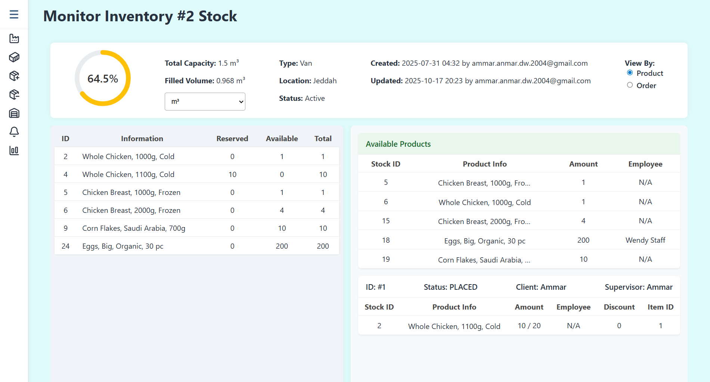
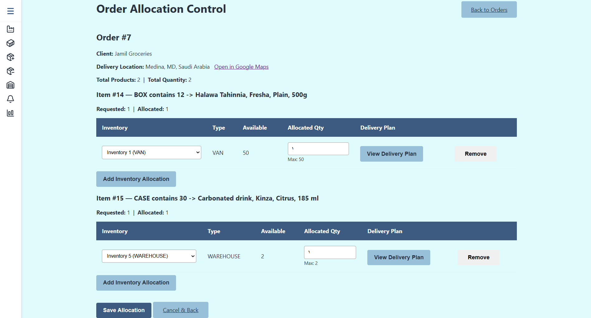
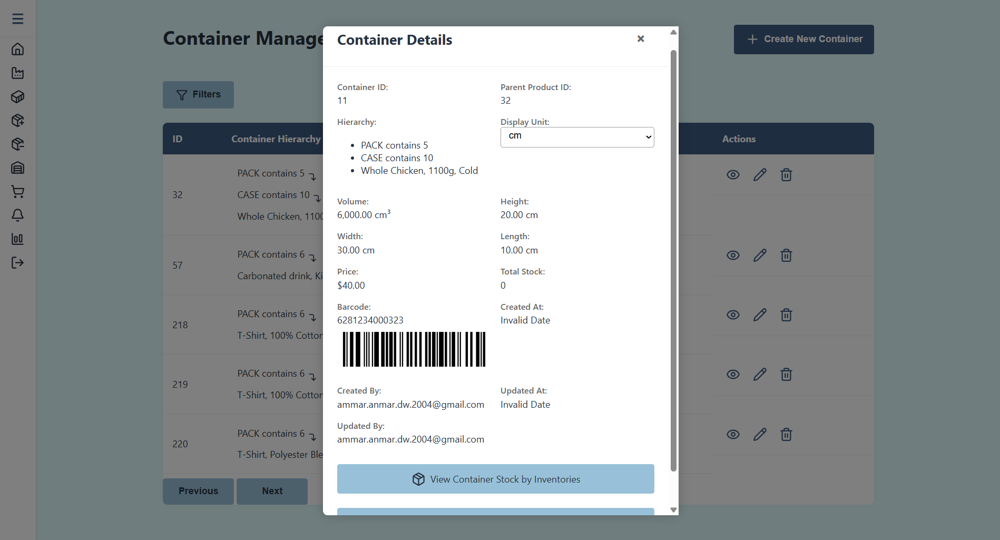
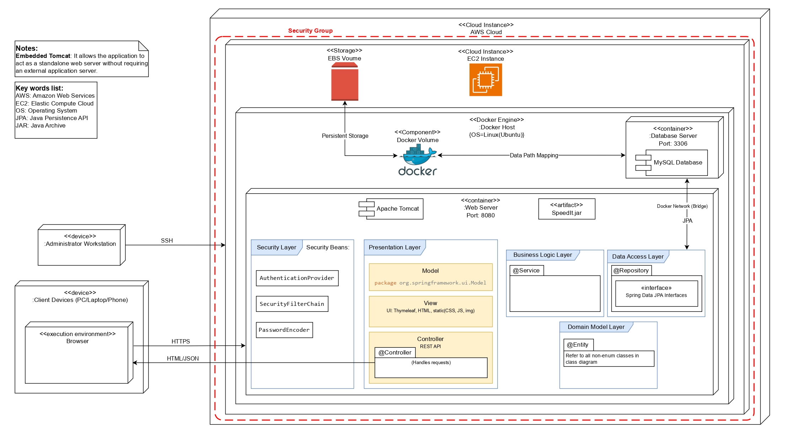

# SpeedIt – Inventory Tracking & Order Management System

**SpeedIt** is a full-stack enterprise logistics solution designed to modernize manual supply chain workflows. The system replaces error-prone manual tracking with an automated environment featuring a smart allocation engine, recursive packaging hierarchies, and real-time inventory visibility.

---

## 🏗️ System Architecture
The system is built on a **3-Tier Client-Server Architecture** to ensure a clean separation of concerns, scalability, and security.

* **Presentation Layer:** Dynamic web interface built for role-based access (Admin, Vendor, Warehouse Staff).
* **Logic Layer:** Developed with **Java and Spring Boot**, handling complex business rules and the allocation algorithm.
* **Data Layer:** Optimized **MySQL** relational database with a normalized schema to ensure data integrity across thousands of stock records.

---

## 🚀 Core Functionalities

### 1. Multi-Level Recursive Container Management
Unlike standard flat inventory systems, SpeedIt allows for unlimited nested packaging (e.g., **Product > Box > Case > Pallet**). 
* **Technical Implementation:** Engineered a self-referential data model that allows the system to recursively calculate total stock and dimensions from the base product up to the bulk container.
* **Value:** 100% traceability of goods throughout the entire logistics chain.

### 2. Intelligent Order Allocation Algorithm
A proprietary scoring engine that suggests the most efficient inventory source for any given order.
* **Criteria:** Evaluates geographic distance (via routing services), current van capacity, and handling effort.
* **Logic:** Prefers larger "chunks" of stock to avoid "tiny splits" and prioritizes inventories closest to the client to minimize travel time.

### 3. Real-Time Visibility Dashboard (3-Panel Layout)
An advanced monitoring interface that provides a single-pane-of-glass view for warehouse managers.
* **Real-time Tracking:** Displays fill-level percentages, capacity metrics, and a detailed breakdown of Reserved vs. Available stock.
* **Interconnected Panels:** Independent scrolling panels allow users to drill down from high-level inventory stats to specific order item details instantly.

### 4. Automated Barcode & Audit Systems
* **Barcode Generation:** Automatic checksum-validated barcode generation for every new product and container.
* **Lifecycle Auditing:** Full traceability of "Created By/At" and "Updated By/At" for every entity in the system.

---

## 🛠️ Technical Challenges Overcome
* **Data Consistency:** Solved the challenge of transitioning manual "paper" records into a digital database by implementing atomic transaction boundaries in the service layer.
* **Algorithm Performance:** Optimized the allocation engine to handle multiple constraints (routing + stock + capacity) while maintaining a responsive user experience.
* **Recursive Mapping:** Implemented recursive DTO mapping to prevent infinite loops during JSON serialization of complex container strains.

---

## 📸 System Preview
*(Note: Source code is private for intellectual property protection. UI and Architecture highlights are provided below.)*

### 📊 Monitoring Dashboard

*Figure 1: The 3-panel layout showing real-time stock-fill levels and order associations.*

### 🗺️ Order Allocation Control

*Figure 2: The interface where admins review and override algorithm-suggested delivery plans.*

### 📦 Container View Modal

*Figure 3: The modal on the container management page for viewing the detials of a specific container with its barcode.*

### 🧬 Architecture Overview

*Figure 4: High-level 3-Tier system design.*

---

## 💻 Technology Stack
* **Backend:** Java, Spring Boot, Spring Security, Spring Data JPA
* **Frontend:** JavaScript, Thymeleaf
* **Database:** MySQL
* **Tools:** GitHub, Maven, Draw.io (Architecture Design)
